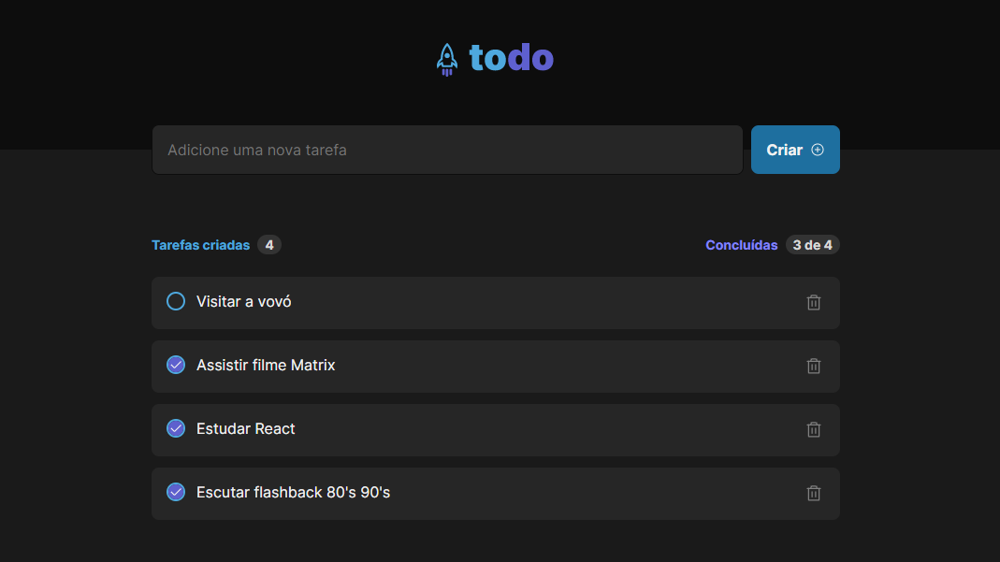

<h1 align="center">
  
</h1>

  

<h2>📋 Sobre</h2>

O todo-list é uma aplicação web para ajudar as pessoas a terem um maior controle sobre suas tarefas do cotidiano. Ela permite que o usuário crie uma lista com várias tarefas, e depois faça alterações no status de cada tarefa, marcando-as como feitas, ou deletando as mesmas. Para utilizar o projeto, entre no link: <a href="https://ignite-todo-list-azure.vercel.app/" target="_blank">Site todo-list</a>

 
<h2>🎯 Objetivo</h2>

Este projeto foi um desafio solicitado pela Rocketseat, durante o bootcamp Ignite, para consolidar na prática os conhecimentos aprendidos sobre a biblioteca React no primeiro módulo do curso Fundamentos do React: Componentes, Propriedades, Estados, Iteração em listas, Typescript, Módulos CSS, etc.

 
<h2>🛠️ Tecnologias e ferramentas/bibliotecas utilizadas</h2>
<ul>
  <li><a href="https://reactjs.org/">ReactJS</a></li>
  <li><a href="https://www.typescriptlang.org/">Typescript</a></li>
  <li><a href="https://phosphoricons.com/">Phospor-Icons</a></li>
</ul>
 
<h2>🔖 Layout</h2>

Você pode visualizar o layout do projeto através deste link: <a href="https://www.figma.com/file/0n0zDN7zbzhRbaEO74Xesx/ToDo-List/duplicate">Layout do projeto</a>. É necessário possuir uma conta no <a href="https://figma.com">Figma</a> para acessá-lo.

 
 

Made by Matheus Pazinati 🛸
